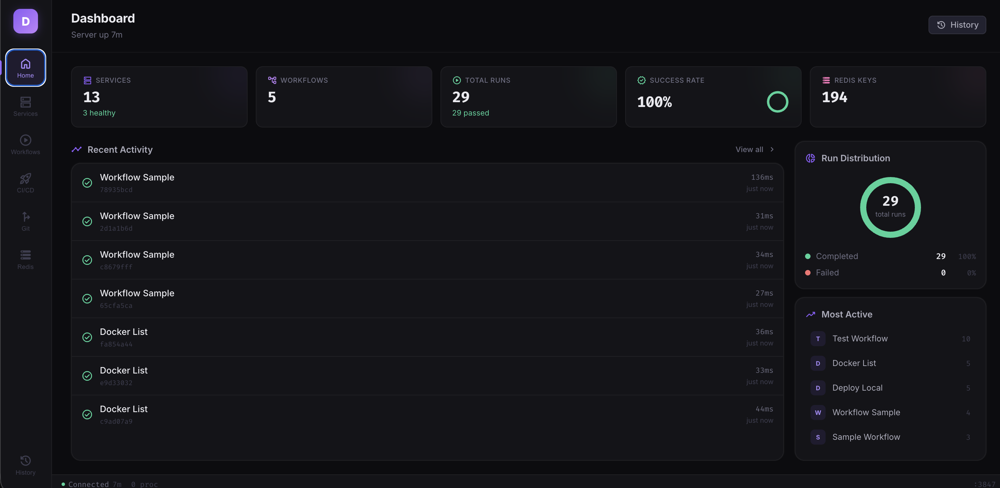
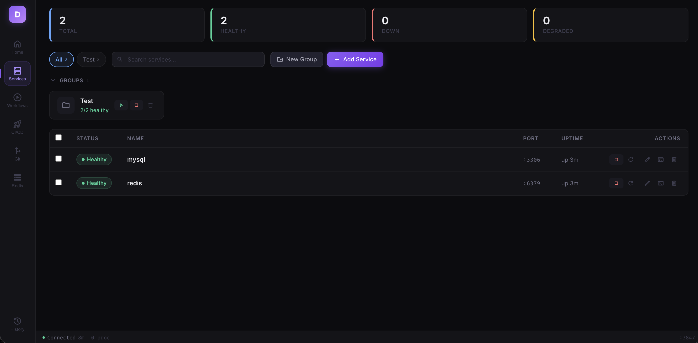
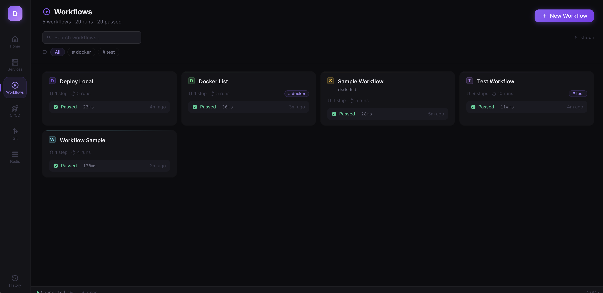
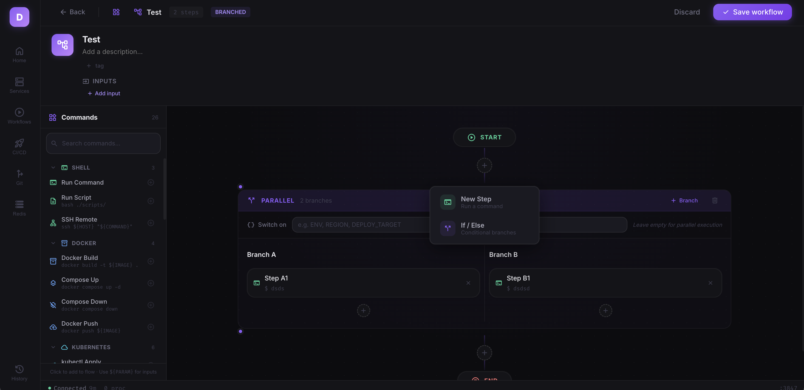

# DevDash

A local development dashboard that brings together your services, workflows, CI/CD, Redis, and git repos into one interface. Runs as a background service on your machine.



## Install

```bash
npm install -g dashdev
```

## Usage

```bash
dashdev start       # Start the server in the background
dashdev stop        # Stop the server
dashdev restart     # Restart the server
dashdev status      # Check if running
dashdev open        # Open dashboard in browser
dashdev logs        # View server logs
```

Dashboard runs at [http://localhost:3847](http://localhost:3847).

### Auto-start on login (macOS)

```bash
dashdev install     # Register as launchd service
dashdev uninstall   # Remove auto-start
```

## Features

### Service Monitor

Track and manage local services (databases, APIs, workers). See health status at a glance, start/stop with one click, and view logs.

- Port-based and HTTP health checks
- Import services from backendctl files
- Service groups for bulk start/stop
- Real-time health polling via WebSocket



### Workflows

Create multi-step workflows visually. Add commands from a template sidebar, chain them in sequence or parallel, and configure parameters.

- 25+ command templates across Shell, Docker, K8s, Node, Git, Redis, HTTP
- Drag-and-drop step ordering
- Parameter auto-detection from `${PLACEHOLDER}` syntax
- Run with custom inputs via parameter modal





### CI/CD

View your GitHub pull requests, review requests, and CI runs in one place. No more switching between browser tabs.

- My PRs with review status and CI checks
- PRs awaiting your review
- Recent CI/CD runs across repos

### Redis Explorer

Browse and edit Redis keys without a CLI. Supports all data types.

- Key browser with pattern filtering
- View/edit string, hash, list, set, sorted set values
- Server info dashboard (memory, clients, uptime)
- TTL display and key deletion

### Git Repos

Track all your local repositories from one screen. See which repos have uncommitted changes, which branches you're on, and who's ahead or behind.

- Add repos manually or scan a directory
- Branch, changes, ahead/behind at a glance
- One-click fetch and pull
- Last commit info

### Run History

Full history of every workflow run with duration, status, step-by-step logs, and exit codes.

## Configuration

| Environment Variable | Default | Description |
|---------------------|---------|-------------|
| `DEVDASH_PORT` | `3847` | Server port |
| `DEVDASH_REDIS_URL` | `redis://localhost:6379` | Redis connection URL |

All data is stored in `~/.devdash/`:
- `devdash.db` — SQLite database (services, workflows, runs, settings)
- `workflows/` — YAML and JS workflow files (auto-synced)
- `devdash.log` — Server logs
- `devdash.pid` — PID file for background daemon

## Adding Workflows

Drop `.yml` or `.js` files into `~/.devdash/workflows/`. DevDash picks them up automatically.

```yaml
# ~/.devdash/workflows/deploy.yml
name: Deploy
steps:
  - name: Run tests
    command: npm test
  - name: Build
    command: npm run build
  - name: Deploy
    command: ./scripts/deploy.sh
```

Or create workflows from the UI using the visual workflow builder.

## Development

```bash
git clone https://github.com/sarthikbhat/devdash.git
cd devdash
npm install
cd ui && npm install && cd ..
npm run dev:all
```

This starts the backend (with hot reload) and Vite dev server concurrently.

## Tech Stack

- **Backend**: Node.js, Express, Socket.IO, better-sqlite3
- **Frontend**: React 18, Vite, TypeScript
- **Storage**: SQLite (local), no external database required

## License

MIT
